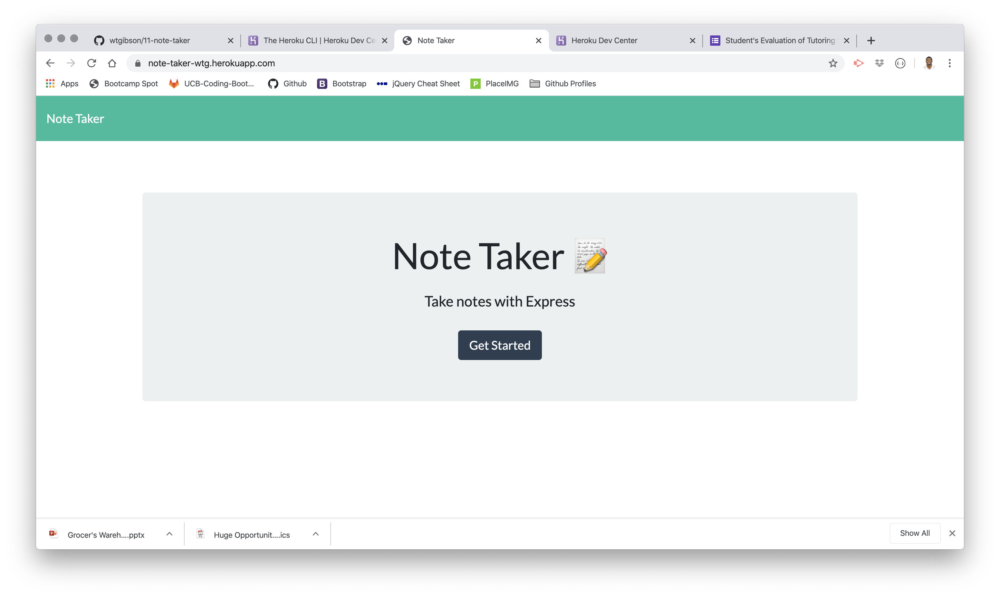
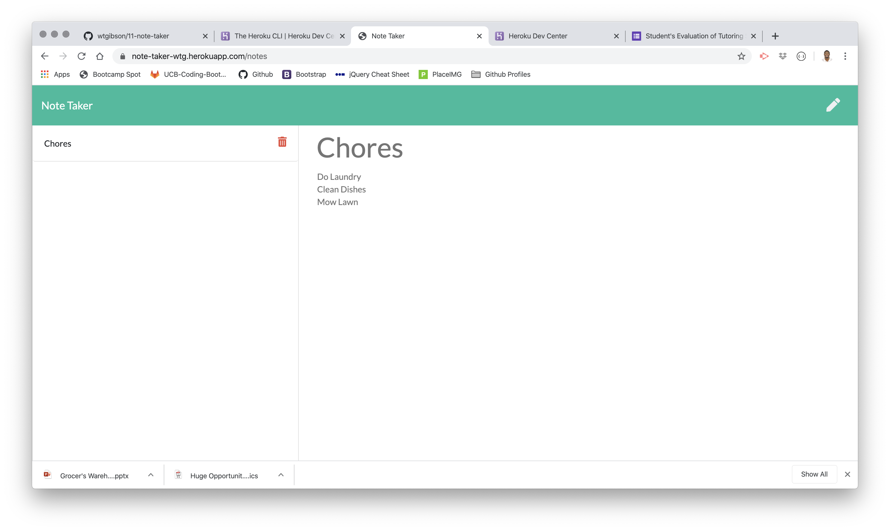

# 11 Express: Note Taker

## Summary 

The purpose of the assignment was to create an application that can be used to write, save, and delete notes. This application uses an express backend and save and retrieve note data from a JSON file.


```
User Story

AS A user, I want to be able to write and save notes
I WANT to be able to delete notes I've written before
SO THAT I can organize my thoughts and keep track of tasks I need to complete

Acceptance Criteria

- Application should allow users to create and save notes
- Application should allow users to view previously saved notes
- Application should allow users to delete previously saved notes
```

## Application Pictures




## Technologies Used

- HTML - used to create elements on the DOM
- CSS - styles HTML elements on page
- Bootstrap - CSS framework directed at responsive, mobile first front-end web development
- JavaScript - provides dynamic interactivity on HTML documents
- jQuery - easy to use API library simplifying Javascript actions
- Node.js - asynchronous event-driven JavaScript runtime
- Express - Node.js web application server framework, designed for building web applications
- Git - version control system to track changes to source code
- GitHub - hosts repository that can be deployed to GitHub Pages

## Code Snippet

Below is a block of code in the server.js file that enables the note saving functionality of the app. 

```js
app.post("/api/notes", (req, res) => {
    const newNote = req.body;
    const newID = Date.now();
    newNote.id = newID;

    fs.readFile(dbPath, (err, data) => {
        if (err) throw err;
        const notes = JSON.parse(data);

        notes.push(newNote);
        const writeNotes = JSON.stringify(notes);
        fs.writeFile(dbPath, writeNotes, err => {
            if (err) throw err;
            res.sendFile(dbPath);
        });
    });
});
```

[Deployed Portfolio Page Site](https://note-taker-wtg.herokuapp.com/)

[GitHub Project Repo](https://github.com/wtgibson/11-note-taker)

## Author Links


Will Gibson

[LinkedIn](https://www.linkedin.com/in/wtgibson/)

[GitHub](https://github.com/wtgibson)

Special thanks to Mahisha Gunasekaran, Kerwin Hy, and Jeremy Cantwell for their input and assistance with the assignment!